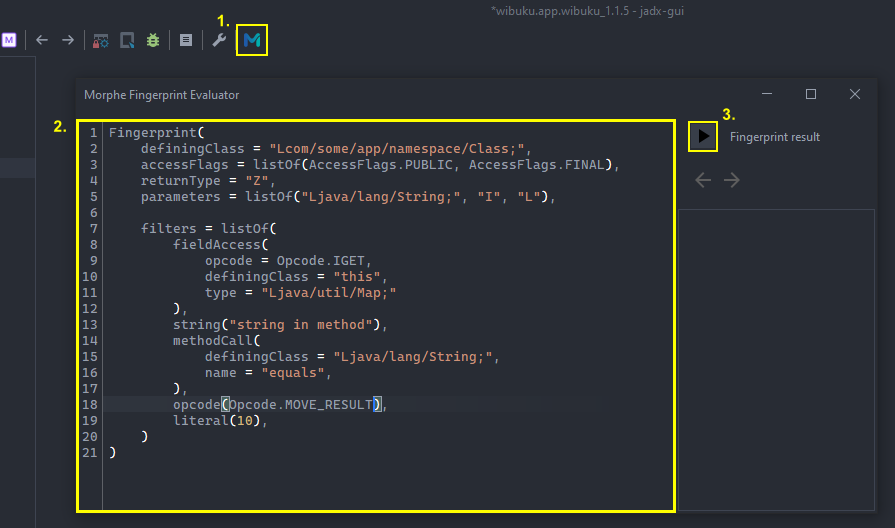

# jadx-morphe

A plugin for JADX to test Morphe-style fingerprints on-the-fly.

> [!WARNING]
> Unique fingerprint generation is not yet implemented.

Original codebase has been updated to support JADX 1.5.2+ and the Morphe API. All credit goes to [valonsdev](https://github.com/valonsodev/jadx-revanced) for the original work.

## Installation

**jadx-gui:**
1. Open `Preferences` go to `Plugins` section -> `Install plugin` button
2. Install from either:
   - local file: `file:C:\path\to\patch\jadx-morphe.jar`
   - github release: `github:hoo-dles:jadx-morphe`

**jadx-cli:**
1. Install from either:
   - local file: `jadx plugins --install-jar jadx-morphe.jar`
   - github release: `jadx plugins --install "github:hoo-dles:jadx-morphe"`

## Building 

> [!IMPORTANT]
> A GitHub access token is necessary for accessing the `morphe-patcher` repo.

1. Clone this repository.
2. Run `./gradlew plugin:dist` to build the plugin (output is placed in `plugin/build/dist`).
